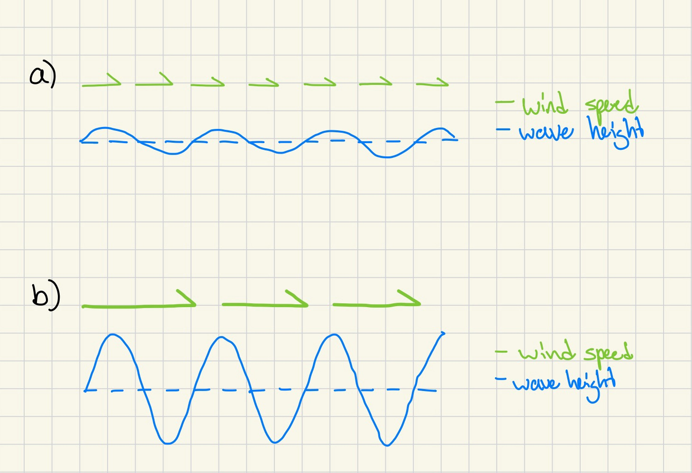

# Background

### What is $H_s$?

Significant wave height ($H_s$), is a statistical quantity that describes the amplitude of waves for a given sea state. For a given sea surface record (e.g., 30 minutes), $H_s$ represents the mean of the largest $\frac{1}{3}$ of recorded wave amplitudes, where the amplitude is defined as the vertical distance between wave troughs and crests. The term "**significant**" reflects the idea that this mean corresponds roughly to the visual impression of wave heights. Unlike sea surface elevation, which oscillates between positive values (wave crests) and negative values (wave troughs), $H_s$ is always a positive quantity.

### Different processes that can modify $H_s$:

**Enhanced winds at the surface (effect from storms):** 
Storms produce strong winds which create waves through an exchange of momentum between the atmosphere and ocean (Holthuijsen 2010).  These waves are known as wind-sea. Wind-sea waves typically have shorter periods and amplitudes resulting in less wave energy. Their larger counterparts, known as swell, have longer periods and much higher amplitudes. Swell do not typically feel the affect of winds because of their already high wave energy. In contrast to the spatial scale we are focusing on (<30 km), this process occurs at larger scales (>30 km).

**Figure 1: A sketch visualizing the effect of non-local winds on wave height. Weak winds result in smaller waves and a smoother sea. Strong winds result in higher waves and a rougher sea. For this effect to be present in the $H_s$ signature, the winds must blow for long periods of time.**

**Current induced refraction (non-local effect):** 
Refraction leads to convergences and divergences of wave action through changes in wave direction. These changes in wave directions are caused by spatial gradients in current velocity. When a gradient in velocity is present, there is vorticity that induces a change in wave direction.

**Figure 2: A sketch visualizing current induced refraction. On the left side of both sketches, there is no current induced vorticity. In 2a, the right side shows a consistent vorticity which causes a refraction of the wave direction. In 2b, the right side shows a spatial variation in vorticity creating a refraction of wave direction and an enhancement of wave height from a convergence of wave action.**

**Enhanced winds at the surface (local effect):** 
When crossing from the cold side to the warm side of a temperature front, there is a decrease in the vertical stability of the atmosphere which intensifies the turbulence in the atmospheric boundary layer. Because of this, near-surface wind shear is amplified and increases near-surface winds (Frenger et al. 2013). These near-surface winds create wind-sea. While they are present in a physical sense, when analyzing $H_s$ signatures wind-sea is not visible because of the statistical nature of this wave variable. This process is currently only backed by theory and is not well established. There is still much to be answered about this phenomenon.

**Figure 3: A sketch visualizing enhanced surface winds crossing along a cold-to-warm front. Moving from cold to warm waters increases turbulence which increases surface wind speeds.**

**Concertina effect (local effect):** 
This effect can work two ways. If current and wave directions are aligned and moving in the same direction, or coflowing, wave height can decrease from currents stretching the waves and influencing a longer period. If current and wave directions are aligned and moving in opposing directions, wave height can increase from currents pushing the into waves and influencing a shorter period. The impact of this effect is stronger on waves with shorter period and wavelength.

**Figure 4: A sketch visualizing the concertina effect. 4a represents a case where wave and current directions are coflowing, or aligned. This results in a lengthened period and decreased wave height. 4b presents a case where currents are moving in opposing directions. This results in a shortened period and increased wave height.**
